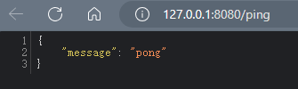

# go-gin-example 
从2023.12.22开始学习煎鱼大佬的该项目
[煎鱼大佬网站](https://eddycjy.com/go-categories/)
[原github地址](https://github.com/eddycjy/go-gin-example)

# 环境准备
## 初始化 Go Modules
**Go Modules** 是go的**依赖包管理**工具,现在的go版本自动打开modules，目前的`go get`命令也是需要进行初始化才能进行拉取

在准备的文件夹的终端中执行
```
$ go env -w GOPROXY=https://goproxy.cn,direct

$ go mod init [github.com/kingsill/gin-example]
```
`go env -w GOPROXY=...`：设置 GOPROXY 代理，这里主要涉及到两个值，第一个是 https://goproxy.cn，它是由七牛云背书的一个强大稳定的 Go 模块代理，可以有效地解决你的外网问题；第二个是 direct，它是一个特殊的 fallback 选项，它的作用是用于指示 Go 在拉取模块时遇到错误会回源到模块版本的源地址去抓取（比如 GitHub 等）。

`go mod init [MODULE_PATH]`：初始化 Go modules，它将会生成 go.mod 文件，需要注意的是 MODULE_PATH 填写的是模块引入路径，你可以根据自己的情况修改路径。
这里我们使用github域名作为项目名是证明这个包使用github进行存储。


此时 **.mod**文件内容。是当前的 **模块路径** 和 预期的 **Go 语言版本** 。
```
module github.com/kingsill/gin-example

go 1.21.4
```


### 基础使用
- 用 go get 拉取新的依赖
    - 拉取最新的版本(优先择取 tag)：go get golang.org/x/text@latest
    - 拉取 master 分支的最新 commit：go get golang.org/x/text@master
    - 拉取 tag 为 v0.3.2 的 commit：go get golang.org/x/text@v0.3.2
    - 拉取 hash 为 342b231 的 commit，最终会被转换为 v0.3.2：go get golang.org/x/text@342b2e
    - 用 go get -u 更新现有的依赖
    - 用 go mod download 下载 go.mod 文件中指明的所有依赖
    - 用 go mod tidy 整理现有的依赖
    - 用 go mod graph 查看现有的依赖结构
    - 用 go mod init 生成 go.mod 文件 (Go 1.13 中唯一一个可以生成 go.mod 文件的子命令)
- 用 go mod edit 编辑 go.mod 文件
- 用 go mod vendor 导出现有的所有依赖 (事实上 Go modules 正在淡化 Vendor 的概念)
- 用 go mod verify 校验一个模块是否被篡改过

## gin 安装
在项目的根目录的命令行执行
```
$ go get -u github.com/gin-gonic/gin
```

此时我们的目录如下所示，**多出.sum文件**
`go.sum `文件详细罗列了当前项目直接或间接依赖的所有模块版本，并写明了那些模块版本的 SHA-256 哈希值以备 Go 在今后的操作中保证项目所依赖的那些模块版本不会被篡改。
```
gin-example learn
├─ .idea
│  └─ workspace.xml
├─ go.mod
├─ go.sum
└─ README.md

```

此时go.mod文件也多了一些内容。

```
module github.com/kingsill/gin-example

go 1.21.4

require (
	github.com/bytedance/sonic v1.10.2 // indirect
	github.com/chenzhuoyu/base64x v0.0.0-20230717121745-296ad89f973d // indirect
	github.com/chenzhuoyu/iasm v0.9.1 // indirect
	github.com/gabriel-vasile/mimetype v1.4.3 // indirect
	github.com/gin-contrib/sse v0.1.0 // indirect
	github.com/gin-gonic/gin v1.9.1 // indirect
	github.com/go-playground/locales v0.14.1 // indirect
	github.com/go-playground/universal-translator v0.18.1 // indirect
	github.com/go-playground/validator/v10 v10.16.0 // indirect
	github.com/goccy/go-json v0.10.2 // indirect
	github.com/json-iterator/go v1.1.12 // indirect
	github.com/klauspost/cpuid/v2 v2.2.6 // indirect
	github.com/leodido/go-urn v1.2.4 // indirect
	github.com/mattn/go-isatty v0.0.20 // indirect
	github.com/modern-go/concurrent v0.0.0-20180306012644-bacd9c7ef1dd // indirect
	github.com/modern-go/reflect2 v1.0.2 // indirect
	github.com/pelletier/go-toml/v2 v2.1.1 // indirect
	github.com/twitchyliquid64/golang-asm v0.15.1 // indirect
	github.com/ugorji/go/codec v1.2.12 // indirect
	golang.org/x/arch v0.6.0 // indirect
	golang.org/x/crypto v0.17.0 // indirect
	golang.org/x/net v0.19.0 // indirect
	golang.org/x/sys v0.15.0 // indirect
	golang.org/x/text v0.14.0 // indirect
	google.golang.org/protobuf v1.32.0 // indirect
	gopkg.in/yaml.v3 v3.0.1 // indirect
)

```

**go.mod** 文件是启用了 Go modules 的项目所必须的最重要的文件，因为它描述了当前项目（也就是当前模块）的元信息，每一行都以一个动词开头，目前有以下 5 个动词:

- module：用于定义当前项目的模块路径。
- go：用于设置预期的 Go 版本。
- require：用于设置一个特定的模块版本。
- exclude：用于从使用中排除一个特定的模块版本。
- replace：用于将一个模块版本替换为另外一个模块版本。

你可能还会疑惑 indirect 是什么东西，indirect 的意思是传递依赖，也就是非直接依赖。

### 测试gin是否引入
[gin部分学习博客](https://blog.csdn.net/kingsill/article/details/133611318?ops_request_misc=%257B%2522request%255Fid%2522%253A%2522170324611116800192214773%2522%252C%2522scm%2522%253A%252220140713.130102334.pc%255Fblog.%2522%257D&request_id=170324611116800192214773&biz_id=0&utm_medium=distribute.pc_search_result.none-task-blog-2~blog~first_rank_ecpm_v1~rank_v31_ecpm-1-133611318-null-null.nonecase&utm_term=gin&spm=1018.2226.3001.4450)

编写test.go文件并执行
```go
package main

import "github.com/gin-gonic/gin"

func main() {
	e := gin.Default()
	e.GET("/ping", func(c *gin.Context) {
		c.JSON(200, gin.H{"message": "pong"})
	})
	e.Run()
}

```
访问 `127.0.0.1:8080`,如下则正确安装


此时我们go.mod文件中使用的依赖 后缀也 都是indirect，这时候我们需要使用`go mod tidy`进行依赖整理，这个命令非常常用

整理完之后go.mod文件如下所示：gin已经是直接依赖
```go
module go-gin-example

go 1.21.4

require github.com/gin-gonic/gin v1.9.1

require (
	github.com/bytedance/sonic v1.10.2 // indirect
	github.com/chenzhuoyu/base64x v0.0.0-20230717121745-296ad89f973d // indirect
	github.com/chenzhuoyu/iasm v0.9.1 // indirect
	github.com/gabriel-vasile/mimetype v1.4.3 // indirect
	github.com/gin-contrib/sse v0.1.0 // indirect
	github.com/go-playground/locales v0.14.1 // indirect
	github.com/go-playground/universal-translator v0.18.1 // indirect
	github.com/go-playground/validator/v10 v10.16.0 // indirect
	github.com/goccy/go-json v0.10.2 // indirect
	github.com/json-iterator/go v1.1.12 // indirect
	github.com/klauspost/cpuid/v2 v2.2.6 // indirect
	github.com/leodido/go-urn v1.2.4 // indirect
	github.com/mattn/go-isatty v0.0.20 // indirect
	github.com/modern-go/concurrent v0.0.0-20180306012644-bacd9c7ef1dd // indirect
	github.com/modern-go/reflect2 v1.0.2 // indirect
	github.com/pelletier/go-toml/v2 v2.1.1 // indirect
	github.com/twitchyliquid64/golang-asm v0.15.1 // indirect
	github.com/ugorji/go/codec v1.2.12 // indirect
	golang.org/x/arch v0.6.0 // indirect
	golang.org/x/crypto v0.17.0 // indirect
	golang.org/x/net v0.19.0 // indirect
	golang.org/x/sys v0.15.0 // indirect
	golang.org/x/text v0.14.0 // indirect
	google.golang.org/protobuf v1.32.0 // indirect
	gopkg.in/yaml.v3 v3.0.1 // indirect
)

```

# gin搭建Blog API's
由于要避免以下问题：
- 程序的文本配置写在代码中
- API的错误码硬编码在程序中
- DB句柄谁都open，没有通一管理
- 获取分页等公共参数 一人一套逻辑
我们选择进行配置文件，这里我们选择[go-ini/ini](https://github.com/go-ini/ini),要先简单阅读其[中文文档](https://ini.unknwon.io/)

 ## go-ini
 ### 简述配置文件
配置文件本质上是包含成功操作程序所需信息的文件，这些信息以特定方式构成。是用户可配置的，通常存储在纯文本文件中

配置文件可以是各种格式，完全凭借程序员的发挥，不过出于方便，大部分会选择的配置文件格式集中在那几种.一般而言程序启动时，会加载该程序对应的配置文件内的信息

**有这么几点作用**：
1.数据库的连接工作
2.端口号的配置
3.打印日志等等

## 阶段目标 编写简单API错误码包 完成一个demo

### 初始化项目
将目录结构更新到如下所示：

```
go-gin-example/
├── conf
├── middleware
├── models
├── pkg
├── routers
└── runtime
```

- conf：用于存储配置文件
- middleware：应用中间件
- models：应用数据库模型
- pkg：第三方包
- routers 路由逻辑处理
- runtime：应用运行时数据

### 初始化项目数据库
新建 `blog` 数据库，编码为`utf8_general_ci`，在 blog 数据库下，新建以下表
1. 标签表
```sql
CREATE TABLE `blog_tag` (
  `id` int(10) unsigned NOT NULL AUTO_INCREMENT,
  `name` varchar(100) DEFAULT '' COMMENT '标签名称',
  `created_on` int(10) unsigned DEFAULT '0' COMMENT '创建时间',
  `created_by` varchar(100) DEFAULT '' COMMENT '创建人',
  `modified_on` int(10) unsigned DEFAULT '0' COMMENT '修改时间',
  `modified_by` varchar(100) DEFAULT '' COMMENT '修改人',
  `deleted_on` int(10) unsigned DEFAULT '0',
  `state` tinyint(3) unsigned DEFAULT '1' COMMENT '状态 0为禁用、1为启用',
  PRIMARY KEY (`id`)
) ENGINE=InnoDB DEFAULT CHARSET=utf8 COMMENT='文章标签管理';
```

2. 文章表

```sql
CREATE TABLE `blog_article` (
  `id` int(10) unsigned NOT NULL AUTO_INCREMENT,
  `tag_id` int(10) unsigned DEFAULT '0' COMMENT '标签ID',
  `title` varchar(100) DEFAULT '' COMMENT '文章标题',
  `desc` varchar(255) DEFAULT '' COMMENT '简述',
  `content` text,
  `created_on` int(11) DEFAULT NULL,
  `created_by` varchar(100) DEFAULT '' COMMENT '创建人',
  `modified_on` int(10) unsigned DEFAULT '0' COMMENT '修改时间',
  `modified_by` varchar(255) DEFAULT '' COMMENT '修改人',
  `deleted_on` int(10) unsigned DEFAULT '0',
  `state` tinyint(3) unsigned DEFAULT '1' COMMENT '状态 0为禁用1为启用',
  PRIMARY KEY (`id`)
) ENGINE=InnoDB DEFAULT CHARSET=utf8 COMMENT='文章管理';
```

3. 认证表

```sql
CREATE TABLE `blog_auth` (
  `id` int(10) unsigned NOT NULL AUTO_INCREMENT,
  `username` varchar(50) DEFAULT '' COMMENT '账号',
  `password` varchar(50) DEFAULT '' COMMENT '密码',
  PRIMARY KEY (`id`)
) ENGINE=InnoDB DEFAULT CHARSET=utf8;

INSERT INTO `blog`.`blog_auth` (`id`, `username`, `password`) VALUES (null, 'test', 'test123456');
```


