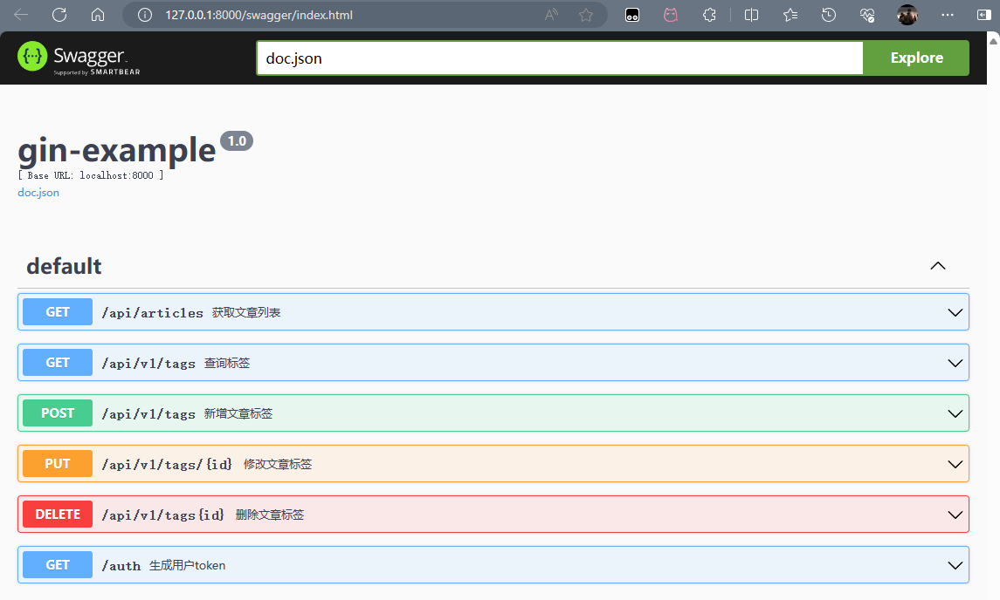

[上一节链接](https://blog.csdn.net/kingsill/article/details/136463611?spm=1001.2014.3001.5502)

# swagger
## 为什么要用swagger
问题起源于 **前后端分离**，
- **后端**：后端控制层，服务层，数据访问层【后端团队】
- **前端**：前端控制层，视图层，【前端团队】
所以产生问题：**前后端联调**，前端和后端人员无法做到及时协商，解决问题，导致问题爆发
## 什么是swagger
`Swagger`是一款`RESTFUL`接口的文档在线自动生成+功能测试功能软件。
- 号称世界上最流行的`api框架`
- Restful Api文档在线自动生成工具==》api文档和api定义开发

# 本文目标
完成本文所搭建的`gin-example`项目的`api`文档，自动生成接口文档。
## 安装swag
```shell
$ go get -u github.com/swaggo/swag/cmd/swag@v1.6.5
```
将swag添加到全局的可执行文件夹下
```shell
mv $GOPATH/bin/swag /usr/local/go/bin
```
### 验证安装是否成功
尝试以下命令是否能够正常执行
```shell
$ swag -v
```
### 安装 gin-swagger
```shell
go get -u github.com/swaggo/gin-swagger
go get -u github.com/swaggo/files
```
## 编写api注释--如何与gin集成
[注释格式文档](https://github.com/swaggo/swag/blob/master/README_zh-CN.md#%E5%A3%B0%E6%98%8E%E5%BC%8F%E6%B3%A8%E9%87%8A%E6%A0%BC%E5%BC%8F)
[如何与gin集成部分](https://github.com/swaggo/swag/blob/master/README_zh-CN.md#%E5%A6%82%E4%BD%95%E4%B8%8Egin%E9%9B%86%E6%88%90)
Swagger 中需要将相应的注释或注解编写到方法上，再利用生成器自动生成说明文件
1. 在router.go(管理路由的文件)中引用swagger：
针对swagger新增初始化动作和对应的路由规则
    ```go
    import "github.com/swaggo/gin-swagger" // gin-swagger middleware
    import "github.com/swaggo/files" // swagger embed files
    ```
2. router.go源代码中添加通用的api注释 
这里可以选择`main.go`中进行通用注释，为了方便我们从管理路由的文件进行注释
这里由于是学习用的项目，我们这里选择简单添加`标题title，版本version，以及主机名称及端号host`
```go
...
// @title			gin-example
// @version		1.0
// @host			localhost:8000
func InitRouter() *gin.Engine {
	   ...
}
...
```
3. 添加相关的api操作注释
[api操作的注释文档链接](https://github.com/swaggo/swag/blob/master/README_zh-CN.md#api%E6%93%8D%E4%BD%9C)
我们这里选择添加简单的介绍summary、传入的参数相关信息Param、成功的代码其返回的相关信息success、其路由地址等相关信息router

- auth.go
```go
package api

import (
...
)
...

// @Summary 生成用户token
// @Param username query string true "username"
// @Param password query string true "password"
// @Success 200 {string} json "{"code":200."data":{},"msg":"ok"}"
// @Router /auth [get]
func GetAuth(c *gin.Context) {
...
}
```
- article.go
```go
package v1

import (
...
)

// @Summary 获取单个文章
// @Produce  json
// @Param id path int true "id"
// @Success 200 {string} json "{"code":200,"data":{},"msg":"ok"}"
// @Router /api/articles [get]
func GetArticle(c *gin.Context) {
...
}

// @Summary 获取文章列表
// @Produce  json
// @Param state query int true "state"
// @Param tag_id query int true "tag_id"
// @Success 200 {string} json "{"code":200,"data":{},"msg":"ok"}"
// @Router /api/articles [get]
func GetArticles(c *gin.Context) {
...
}

// @Summary 新增文章
// @Produce  json
// @Param tagId query int true "tagId"
// @Param title query string true "title"
// @Param desc query string true "desc"
// @Param content query string true "content"
// @Param createdBy query string true "createdBy"
// @Param state query int true "state"
// @Success 200 {string} json "{"code":200,"data":{},"msg":"ok"}"
// @Router /api/v1/tags [post]
func AddArticle(c *gin.Context) {
...
}

// @Summary 修改文章
// @Produce  json
// @Param id path int true "id"
// @Param tagId query int true "tagId"
// @Param title query string true "title"
// @Param desc query string true "desc"
// @Param content query string true "content"
// @Param modifiedBy query string true "modifiedBy"
// @Param state query int false "state"
// @Success 200 {string} json "{"code":200,"data":{},"msg":"ok"}"
// @Router /api/v1/tags [post]
func EditArticle(c *gin.Context) {
...
}

// @Summary 删除文章
// @Produce  json
// @Param id path int true "id"
// @Success 200 {string} json "{"code":200,"data":{},"msg":"ok"}"
// @Router /api/v1/tags [post]
func DeleteArticle(c *gin.Context) {
...
}

```
- tag.go
```go
package v1

import (
...
)

// @Summary 查询标签
// @Produce json
// @Param name query string true "name"
// @Success 200 {string} json "{"code":200,"data":{},"msg":"ok"}"
// @Router /api/v1/tags [get]
func GetTags(c *gin.Context) {
...
}

// @Summary 新增文章标签
// @Produce  json
// @Param name query string true "Name"
// @Param state query int false "State"
// @Param created_by query int false "CreatedBy"
// @Success 200 {string} json "{"code":200,"data":{},"msg":"ok"}"
// @Router /api/v1/tags [post]
func AddTag(c *gin.Context) {
...
}

// @Summary 修改文章标签
// @Produce  json
// @Param id path int true "ID"
// @Param name query string true "ID"
// @Param state query int false "State"
// @Param modified_by query string true "ModifiedBy"
// @Success 200 {string} json "{"code":200,"data":{},"msg":"ok"}"
// @Router /api/v1/tags/{id} [put]
func EditTag(c *gin.Context) {
...
}

// @Summary 删除文章标签
// @Produce  json
// @Param name path int true "id"
// @Success 200 {string} json "{"code":200,"data":{},"msg":"ok"}"
// @Router /api/v1/tags{id} [delete]
func DeleteTag(c *gin.Context) {
...
}
```
## 生成说明文件
进入到项目的项目根目录中，执行初始化命令
由于我们的总的通用api注释没有写在`main.go`中，而是在`router.go`中，我们使用`-g`标识符来告知`swag`，如果直接在`main.go`中进行api注释的话可以直接`swag init`
```shell
swag init -g routers/router.go
```
生成完毕之后会在根目录下生成docs文件夹
当前项目的目录树：
```shell
.
├── conf
├── docs
│   ├── docs.go
│   ├── swagger.json
│   └── swagger.yaml
├── middleware
│   └── jwt
├── models
├── pkg
│   ├── e
│   ├── logging
│   ├── setting
│   └── util
├── routers
│   └── api
│       └── v1
└── runtime
    └── logs
```
## 验证
运行并访问`http://127.0.0.1:8000/swagger/index.html` ，查看是否能够正常运行


之后各种操作都简单便利啦