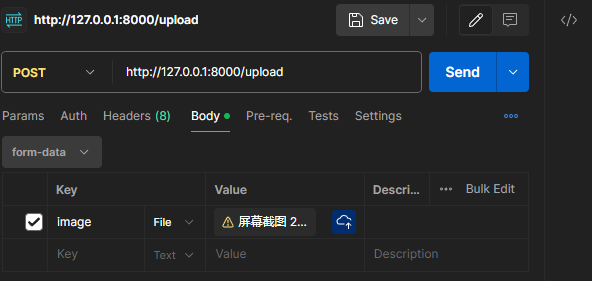
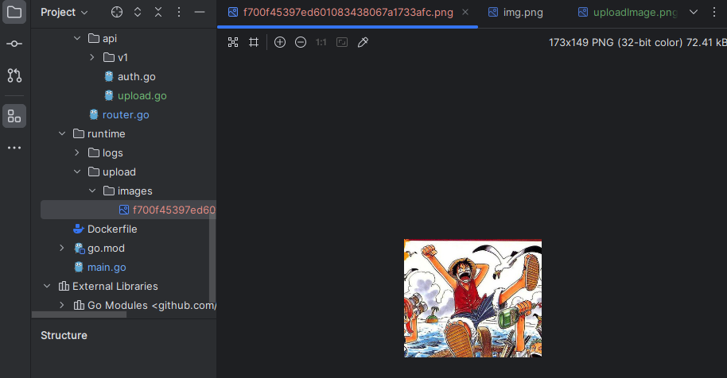

## 前情提要 
[学习项目github地址](https://github.com/EDDYCJY/go-gin-example)

[上一部分学习笔记](https://blog.csdn.net/kingsill/article/details/136850334?spm=1001.2014.3001.5501)

## 本节目标

- 优化配置结构（因为配置项越来越多）
- 抽离 原 `logging` 的 `File` 便于公用（`logging、upload` 各保有一份并不合适）
- 实现上传图片接口（需限制文件格式、大小）
- 修改文章接口（需支持封面地址参数）
- 增加 `blog_article` （文章）的数据库字段
- 实现 `http.FileServer`

# 优化配置结构

## 讲解
[在先前章节中,我们通过读取KEY的方式读取配置项](https://blog.csdn.net/kingsill/article/details/135445193)(建立setting模块)
本次需求中，需要增加图片的配置项，总体就有些冗余了

我们采用以下解决方法：
- **映射结构体**：使用 `MapTo` 来设置配置参数
- **配置统管**：所有的配置项统管到 `setting` 中

## 落实
### 修改配置文件
修改 `conf/app.ini`

增加了 **5** 个配置项用于**上传图片**的功能，**4** 个**文件日志**方面的配置项
```ini
[app]
PageSize = 10
JwtSecret = 233

RuntimeRootPath = runtime/

ImagePrefixUrl = http://127.0.0.1:8000
ImageSavePath = upload/images/
# MB
ImageMaxSize = 5
ImageAllowExts = .jpg,.jpeg,.png

LogSavePath = logs/
LogSaveName = log
LogFileExt = log
TimeFormat = 20060102

[server]
#debug or release
RunMode = debug
HttpPort = 8000
ReadTimeout = 60
WriteTimeout = 60

[database]
Type = mysql
User = root
Password = rootroot
Host = 127.0.0.1:3306
Name = blog
TablePrefix = blog_
```
### 优化配置读取及设置初始化顺序
#### 第一步
将散落在其他文件里的配置都删掉，统一在 `setting` 中处理以及修改 `init` 函数为 `Setup` 方法

1. 打开 pkg/setting/setting.go 文件，修改如下：
```go
package models

import (
	"fmt"
	"log"
	"time"

	"github.com/jinzhu/gorm"
	_ "github.com/jinzhu/gorm/dialects/mysql"

	"github.com/kingsill/gin-example/pkg/setting"
)

// 定义一个全局的数据库连接变量
var db *gorm.DB

// Model 设定常用结构体，可以作为匿名结构体嵌入到别的表格对应的结构体
type Model struct {
	ID         int `gorm:"primary_key" json:"id"`
	CreatedOn  int `json:"created_on"`
	ModifiedOn int `json:"modified_on"`
	DeletedOn  int `json:"deleted_on"`
}

func Setup() {
   //配置文件加载
   Cfg, err := ini.Load("conf/app.ini")
   if err != nil {
      log.Fatalf("Fail to parse 'conf/app.ini': %v", err)
   }

   //将app section 部分映射到AppSetting结构体上
   err = Cfg.Section("app").MapTo(AppSetting)
   if err != nil {
      log.Fatalf("Cfg.MapTo AppSetting err: %v", err)
   }
   //将图片最大大小设置从5字节Byte转换为5兆字节MB
   AppSetting.ImageMaxSize = AppSetting.ImageMaxSize * 1024 * 1024

   err = Cfg.Section("server").MapTo(ServerSetting)
   if err != nil {
      log.Fatalf("Cfg.MapTo ServerSetting err: %v", err)
   }

   //将读取时自动转换的类型转换为时间间隔了，只不过是最小单位纳秒
   ServerSetting.ReadTimeout = ServerSetting.ReadTimeout * time.Second
   ServerSetting.WriteTimeout = ServerSetting.WriteTimeout * time.Second

   err = Cfg.Section("database").MapTo(DatabaseSetting)
   if err != nil {
      log.Fatalf("Cfg.MapTo DatabaseSetting err: %v", err)
   }
}

```
在这里，我们做了如下几件事：
- 编写与配置项保持一致的结构体（`App、Server、Database`）
- 使用 MapTo 将配置项映射到结构体上
- 对一些需特殊设置的配置项进行再赋值

2. 修改models.go
将`init`函数改为`Setup`方法,将独立读取的`DB配置`项删除,改为统一读取`setting`
```go
package models

import (
...
)

// 定义一个全局的数据库连接变量
var db *gorm.DB

// Model 设定常用结构体，可以作为匿名结构体嵌入到别的表格对应的结构体
type Model struct {
	ID         int `gorm:"primary_key" json:"id"`
	CreatedOn  int `json:"created_on"`
	ModifiedOn int `json:"modified_on"`
	DeletedOn  int `json:"deleted_on"`
}

func Setup() {
	var err error

	//使用gorm框架初始化数据库连接
	db, err = gorm.Open(setting.DatabaseSetting.Type, fmt.Sprintf("%s:%s@tcp(%s)/%s?charset=utf8&parseTime=True&loc=Local",
		setting.DatabaseSetting.User,
		setting.DatabaseSetting.Password,
		setting.DatabaseSetting.Host,
		setting.DatabaseSetting.Name))

	if err != nil {
		log.Println(err)
	}

	//自定义默认表的表名，使用匿名函数，在原默认表名的前面加上配置文件中定义的前缀
	gorm.DefaultTableNameHandler = func(db *gorm.DB, defaultTableName string) string {
		return setting.DatabaseSetting.TablePrefix + defaultTableName
	}

	//gorm默认使用复数映射，当前设置后即进行严格匹配
	db.SingularTable(true)
	//log记录打开
	db.LogMode(true)

	//进行连接池设置
	db.DB().SetMaxIdleConns(10)
	db.DB().SetMaxOpenConns(100)

	//替换Create和Update回调函数
	db.Callback().Create().Replace("gorm:update_time_stamp", updateTimeStampForCreateCallback)
	db.Callback().Update().Replace("gorm:update_time_stamp", updateTimeStampForUpdateCallback)

	//添加删除的回调CallBacks
	db.Callback().Delete().Replace("gorm:delete", deleteCallback)
}


// CloseDB 与数据库断开连接函数
func CloseDB() {
	defer db.Close()
}

// updateTimeStampForCreateCallback 在创建记录时设置 `CreatedOn`, `ModifiedOn`
func updateTimeStampForCreateCallback(scope *gorm.Scope) {
	...
}

// updateTimeStampForUpdateCallback 在更新记录时设置 `ModifyOn`
func updateTimeStampForUpdateCallback(scope *gorm.Scope) {
...
}

// 设定delete操作的callback逻辑
func deleteCallback(scope *gorm.Scope) {
	...
}

// 判断是否为空来进行空格插入，防止sql注入，保证安全性
func addExtraSpaceIfExist(str string) string {
	...
}

```

3. 修改log.go
init函数改为Setup方法
```go
func Setup() {
	//获取log文件目录
	filePath := getLogFileFullPath()

	//得到log文件句柄
	F = openLogFile(filePath)

	//创建一个新的日志记录器
	logger = log.New(F, DefaultPrefix, log.LstdFlags)
}
```
4. 修改pkg/logging/file.go

   独立的 `LOG` 配置项删除，改为统一读取 `setting`,修改这两个函数即可
```go
// 返回log文件的前缀路径，算是一个具有仪式感的函数
func getLogFilePath() string {
	return fmt.Sprintf("%s", setting.AppSetting.LogSavePath)
}

// 获得log文件的整体路径，以当前日期作为.log文件的名字
func getLogFileFullPath() string {
	prefixPath := getLogFilePath()
	suffixPath := fmt.Sprintf("%s%s.%s", setting.AppSetting.LogSaveName, time.Now().Format(setting.AppSetting.TimeFormat), setting.AppSetting.LogFileExt)

	return fmt.Sprintf("%s%s", prefixPath, suffixPath)
}

```
5. 其他漏下的未改为统一读取setting的根据报错进行修改即可
### 验证
在这里为止，针对本需求的配置优化就完毕了，你需要执行 `go run main.go` 验证一下你的功能是否正常哦


## 抽离file
1. pkg目录下新建file/file.go
```go
package file

import (
	"io"
	"mime/multipart"
	"os"
	"path"
)

// GetSize multipart.file用于处理HTTP请求中文件上传到类型   os.file则主要是本地文件的操作
func GetSize(f multipart.File) (int, error) {
	content, err := io.ReadAll(f)
	return len(content), err
}

// GetExt 获取文件扩展名
func GetExt(filename string) string {
	return path.Ext(filename)
}

// CheckExist 检查文件是否存在
func CheckExist(src string) bool {
	//os.stat用于获取文件的相关信息
	_, err := os.Stat(src)

	return os.IsNotExist(err)
}

// CheckPermission 检查访问文件的权限
func CheckPermission(src string) bool {
	_, err := os.Stat(src)

	//检查是否有访问文件的权限
	return os.IsPermission(err)
}

// IsNotExistMkDir 检查是否存在目录，不存在则创建目录
func IsNotExistMkDir(src string) error {

	if notExist := CheckExist(src); notExist == true {
		if err := MkDir(src); err != nil {
			return err
		}
	}

	return nil
}

// MkDir 创建目录
func MkDir(src string) error {
	err := os.MkdirAll(src, os.ModePerm) //权限0777，权限拉满
	if err != nil {
		return err
	}

	return nil
}

// Open 算是简单包装os.openfile
func Open(name string, flag int, perm os.FileMode) (*os.File, error) {
	f, err := os.OpenFile(name, flag, perm)
	if err != nil {
		return nil, err
	}

	return f, nil
}

```
在这里我们用到了` mime/multipart` 包，它主要实现了 `MIME` 的` multipart `解析，主要适用于 `HTTP `和常见浏览器生成的 `multipart `主体

2. 修改原`logging`包的方法
- 修改`pkg/logging/file.go`
```go
package logging

import (
   "fmt"
   "github.com/kingsill/gin-example/pkg/file"
   "github.com/kingsill/gin-example/pkg/setting"
   "os"
   "time"
)

// 返回log文件的前缀路径，算是一个具有仪式感的函数
func getLogFilePath() string {
   return fmt.Sprintf("%s", setting.AppSetting.LogSavePath)
}

// 获得log文件的整体路径，以当前日期作为.log文件的名字 runtime/log20010212.log
func getLogFileFullPath() string {
   prefixPath := getLogFilePath()
   suffixPath := fmt.Sprintf("%s%s.%s",
      setting.AppSetting.LogSaveName,
      time.Now().Format(setting.AppSetting.TimeFormat),
      setting.AppSetting.LogFileExt,
   )

   return fmt.Sprintf("%s%s", prefixPath, suffixPath)
}

// 打开日志文件，返回写入的句柄handle
func openLogFile() (*os.File, error) {

   //获取文件整体路径
   fileName := getLogFileFullPath()

   //创建目录
   mkDir()

   //如果.log文件不存在，这里会创建一个
   handle, err := file.Open(fileName, os.O_APPEND|os.O_CREATE|os.O_WRONLY, 0644)
   if err != nil {
      return nil, fmt.Errorf("fail to open:%s\n", fileName)
   }

   return handle, nil
}

// 创建log目录
func mkDir() {
   //获得当前目录 dir: /home/wang2/gin-example
   dir, _ := os.Getwd()

   //检查目录访问权限
   perm := file.CheckPermission(getLogFilePath())
   if perm == true {
      panic("Permission denied")
   }

   //如果目录不存在，创建目录
   err := file.IsNotExistMkDir(dir + "/" + getLogFilePath())
   if err != nil {
      panic(err)
   }
}

```

- 修改`pkg/logging/log.go`
由于原方法传参有变，这里也进行相关调整
```go
...

// Setup 自定义logger的初始化
func Setup() {
	var err error

	//得到log文件句柄
	F, err = openLogFile()
	if err != nil {
		log.Fatalln(err)
	}

	//创建一个新的日志记录器
	logger = log.New(F, DefaultPrefix, log.LstdFlags)
}
...

```

# 实现上传图片接口
首先需要在 `blog_article` 中增加字段 `cover_image_url`，格式为 `varchar(255) DEFAULT '' COMMENT '封面图片地址'`
```sql
alter table blog_article add cover_image_url varchar(255) DEFAULT '' COMMENT '封面图片地址';
```
## 图片名加密
我们通过 `MD5` 对图片进行加密，防止图片名暴露
`util`目录下新建`md5.go`，写入文件内容
```go
package util

import (
	"crypto/md5"
	"encoding/hex"
)

// EncodeMD5 计算给定字符的MD5哈希值，返回其十六进制表示
func EncodeMD5(value string) string {
	//创建一个新的MD5计算器实例
	m := md5.New()

	//将value写入到MD5计算器中
	m.Write([]byte(value))

	//nil表示计算完哈希值后不添加后缀
	return hex.EncodeToString(m.Sum(nil))
}

```

## 封装image的处理逻辑
在 `pkg` 目录下新建`upload/image.go`文件，写入文件内容

这里基本是对底层代码的二次封装，为了更灵活的处理一些图片特有的逻辑，并且方便修改，不直接对外暴露下层
```go
package upload

import (
...
)

func GetImageFullUrl(name string) string {
	return setting.AppSetting.ImagePrefixUrl + "/" + GetImagePath() + name
}

// GetImageName 计算MD5加密之后的图片名
func GetImageName(name string) string {
	//将图片的名字剥离扩展名
	ext := path.Ext(name)
	fileName := strings.TrimSuffix(name, ext)

	//对单纯的图片名进行MD5加密
	fileName = util.EncodeMD5(fileName)

	//将MD5加密后的图片名和后缀返回
	return fileName + ext
}

// GetImagePath 包装文件路径 upload/images/
func GetImagePath() string {
	return setting.AppSetting.ImageSavePath
}

// GetImageFullPath 拼凑完整路径 runtime/+upload/images/
func GetImageFullPath() string {
	return setting.AppSetting.RuntimeRootPath + GetImagePath()
}

// CheckImageExt 检查图片格式是否正确
func CheckImageExt(fileName string) bool {
	ext := file.GetExt(fileName)
	for _, allowExt := range setting.AppSetting.ImageAllowExts {
		//都大写进行对比
		if strings.ToUpper(allowExt) == strings.ToUpper(ext) {
			return true
		}
	}

	return false
}

// CheckImageSize 检查图片的大小是否小于规定的最大值 5M
func CheckImageSize(f multipart.File) bool {
	size, err := file.GetSize(f)

	if err != nil {
		log.Println(err)
		logging.Warn(err)
		return false
	}

	return size <= setting.AppSetting.ImageMaxSize
}

func CheckImage(src string) error {
	dir, err := os.Getwd()
	if err != nil {
		return fmt.Errorf("os.Getwd err: %v", err)
	}

	//检查图片目录
	err = file.IsNotExistMkDir(dir + "/" + src)
	if err != nil {
		return fmt.Errorf("file.IsNotExistMkDir err: %v", err)
	}

	//检查访问权限
	perm := file.CheckPermission(src)
	if perm == true {
		return fmt.Errorf("file.CheckPermission Permission denied src: %s", src)
	}

	return nil
}
```

## 编写上传图片的业务逻辑
在 `routers/api` 目录下新建 `upload.go` 文件，写入内容

```go
package api

import (
...
)

func UploadImage(c *gin.Context) {
	code := e.SUCCESS
	data := make(map[string]string)

	file, image, err := c.Request.FormFile("image")
	if err != nil {
		logging.Warn(err)
		code = e.ERROR
		c.JSON(http.StatusOK, gin.H{
			"code": code,
			"msg":  e.GetMsg(code),
			"data": data,
		})
	}

	if image == nil {
		code = e.INVALID_PARAMS
	} else {
		imageName := upload.GetImageName(image.Filename) //获取图片名
		fullPath := upload.GetImageFullPath()            //图片完整路径
		savePath := upload.GetImagePath()                //仓库内保存路径

		//图片路径+名字
		src := fullPath + imageName

		//检查图片格式和大小
		if !upload.CheckImageExt(imageName) || !upload.CheckImageSize(file) {
			code = e.ERROR_UPLOAD_CHECK_IMAGE_FORMAT
		} else {
			//检查图片目录、访问权限
			err := upload.CheckImage(fullPath)
			if err != nil {
				logging.Warn(err)
				code = e.ERROR_UPLOAD_CHECK_IMAGE_FAIL
			} else if err := c.SaveUploadedFile(image, src); err != nil { //图片保存到指定位置
				logging.Warn(err)
				code = e.ERROR_UPLOAD_SAVE_IMAGE_FAIL
			} else {
				//
				data["image_url"] = upload.GetImageFullUrl(imageName)
				data["image_save_url"] = savePath + imageName
			}
		}
	}

	c.JSON(http.StatusOK, gin.H{
		"code": code,
		"msg":  e.GetMsg(code),
		"data": data,
	})
}

```

在这一大段的业务逻辑中，我们做了如下事情：

- `c.Request.FormFile`：获取上传的图片（返回提供的表单键的第一个文件）
- `CheckImageExt、CheckImageSize` 检查图片大小，检查图片后缀
- `CheckImage`：检查上传图片所需（权限、文件夹）
- `SaveUploadedFile`：保存图片
总的来说，就是 `入参` -> `检查` -》` 保存` 的应用流程

## 增加图片上传的路由
打开 `routers/router.go `文件，增加路由` r.POST("/upload", api.UploadImage)`
```go
func InitRouter() *gin.Engine {
	r := gin.New()
    ...
	r.GET("/auth", api.GetAuth)
	r.GET("/swagger/*any", ginSwagger.WrapHandler(swaggerFiles.Handler))
	r.POST("/upload", api.UploadImage)

	apiv1 := r.Group("/api/v1")
	apiv1.Use(jwt.JWT())
	{
		...
	}

	return r
}
```

# 验证
使用` postman`，测试图片上传功能

看到`runtime/upload/images`下存在我们上传的文件


# 实现前端访问 http.FileServer
在完成了上一小节后，我们还需要让前端能够访问到图片，一般是如下：
- `CDN`
- `http.FileSystem`

在公司的话，`CDN` 或自建分布式文件系统居多，也不需要过多关注。而在实践里的话肯定是本地搭建了，`Go` 本身对此就有很好的支持，而 `Gin` 更是再封装了一层，**只需要在路由增加一行代码即可**
## r.StaticFS
打开 `routers/router.go` 文件，增加路由 `r.StaticFS("/upload/images", http.Dir(upload.GetImageFullPath()))`
```go
func InitRouter() *gin.Engine {
    ...
    //网页 请求我们指定目录内的内容
    r.StaticFS("/upload/images", http.Dir(upload.GetImageFullPath()))
	
	r.GET("/auth", api.GetAuth)
	r.GET("/swagger/*any", ginSwagger.WrapHandler(swaggerFiles.Handler))
	r.POST("/upload", api.UploadImage)
    ...
}
```
`http.dir` 创建了文件系统，将 `/upload/image` 路径映射到我们指定的文件目录中，这里为 `runtime/upload/images/` ，即我们放置图片的文件夹下

更多内容可以查看源码进行学习，到这里可以自行进行验证，访问 `127.0.0.1：8000/upload/images/图片名`

## 修改文章接口

### 新增、更新文章接口
支持入参 `cover_image_url`、增加对` cover_image_url `的非空、最长长度的检验
1. 修改` models/article.go`
```go
...

// Article 建立对应article表的struct结构体，方便进行信息读写
type Article struct {
...

	CoverImageUrl string `json:"cover_image_url"`
}


// AddArticle 添加文章
func AddArticle(data map[string]interface{}) bool {
	db.Create(&Article{
...
		CoverImageUrl: data["cover_image_url"].(string),
	})

	return true
}
...

```
2. 修改 `routers/api/v1/article.go`
对 `AddArticle` 和 `EditArticle` 方法在原来的基础上进行修改，首先将之前为了方便验证写的使用 **查询参数** ，改为 **表单参数**， 更安全
```go
// @Summary	新增文章
// @Produce	json
// @Param		tagId		body		int		true	"tagId"
// @Param		title		body        string	true	"title"
// @Param		desc		body		string	true	"desc"
// @Param		content		body		string	true	"content"
// @Param		createdBy	body		string	true	"createdBy"
// @Param		state		body		int		true	"state"
// @Success	200			{string}	json	"{"code":200,"data":{},"msg":"ok"}"
// @Router		/api/v1/tags [post]
func AddArticle(c *gin.Context) {
	tagId := com.StrTo(c.PostForm("tag_id")).MustInt()
	title := c.PostForm("title")
	desc := c.PostForm("desc")
	content := c.PostForm("content")
	createdBy := c.PostForm("created_by")
	coverImageUrl := c.PostForm("cover_image_url")//**********
	state := com.StrTo(c.DefaultQuery("state", "0")).MustInt()

	valid := validation.Validation{}
	valid.Min(tagId, 1, "tag_id").Message("标签ID必须大于0")
	valid.Required(title, "title").Message("标题不能为空")
	valid.Required(desc, "desc").Message("简述不能为空")
	valid.Required(content, "content").Message("内容不能为空")
	valid.Required(createdBy, "created_by").Message("创建人不能为空")
	valid.Range(state, 0, 1, "state").Message("状态只允许0或1")
	valid.Required(coverImageUrl, "cover_image_url").Message("封面地址不能为空")//***********

	code := e.INVALID_PARAMS
	if !valid.HasErrors() {
		if models.ExistTagByID(tagId) {
			data := make(map[string]interface{})
			data["tag_id"] = tagId
			data["title"] = title
			data["desc"] = desc
			data["content"] = content
			data["created_by"] = createdBy
			data["state"] = state
			data["cover_image_url"] = coverImageUrl//****************

			models.AddArticle(data)
			code = e.SUCCESS
		} else {
			code = e.ERROR_NOT_EXIST_TAG
		}
	} else {
		for _, err := range valid.Errors {
			logging.Info("err.key: %s, err.message: %s", err.Key, err.Message)
		}
	}

	c.JSON(http.StatusOK, gin.H{
		"code": code,
		"msg":  e.GetMsg(code),
		"data": make(map[string]interface{}),
	})
}

// @Summary	修改文章
// @Produce	json
// @Param		id			path		int		true	"id"
// @Param		tagId		body		int		true	"tagId"
// @Param		title		body		string	true	"title"
// @Param		desc		body		string	true	"desc"
// @Param		content		body		string	true	"content"
// @Param		modifiedBy	body		string	true	"modifiedBy"
// @Param		state		body		int		false	"state"
// @Success	200			{string}	json	"{"code":200,"data":{},"msg":"ok"}"
// @Router		/api/v1/tags [post]
func EditArticle(c *gin.Context) {
	valid := validation.Validation{}

	id := com.StrTo(c.Param("id")).MustInt()
	tagId := com.StrTo(c.PostForm("tag_id")).MustInt()
	title := c.PostForm("title")
	desc := c.PostForm("desc")
	content := c.PostForm("content")
	coverImageUrl := c.PostForm("cover_image_url")//******
	modifiedBy := c.PostForm("modified_by")

	var state int = -1
	if arg := c.Query("state"); arg != "" {
		state = com.StrTo(arg).MustInt()
		valid.Range(state, 0, 1, "state").Message("状态只允许0或1")
	}

	valid.Min(id, 1, "id").Message("ID必须大于0")
	valid.Min(tagId, 1, "tag_id").Message("标签ID必须大于0")
	valid.MaxSize(title, 100, "title").Message("标题最长为100字符")
	valid.Required(title, "title").Message("标题不能为空")
	valid.MaxSize(desc, 255, "desc").Message("简述最长为255字符")
	valid.Required(desc, "desc").Message("简述不能为空")
	valid.MaxSize(content, 65535, "content").Message("内容最长为65535字符")
	valid.Required(modifiedBy, "modified_by").Message("修改人不能为空")
	valid.Required(coverImageUrl, "cover_image_url").Message("封面地址不能为空")//****************
	valid.MaxSize(coverImageUrl, 255, "cover_image_url").Message("封面地址最长为255字符")//*************
	valid.MaxSize(modifiedBy, 100, "modified_by").Message("修改人最长为100字符")

	code := e.INVALID_PARAMS
	if !valid.HasErrors() {
		if models.ExistArticleByID(id) {
			if models.ExistTagByID(tagId) {
				data := make(map[string]interface{})
				data["tag_id"] = tagId

				data["title"] = title

				data["desc"] = desc

				data["content"] = content

				data["modified_by"] = modifiedBy

				models.EditArticle(id, data)
				code = e.SUCCESS
			} else {
				code = e.ERROR_NOT_EXIST_TAG
			}
		} else {
			code = e.ERROR_NOT_EXIST_ARTICLE
		}
	} else {
		for _, err := range valid.Errors {
			logging.Info("err.key: %s, err.message: %s", err.Key, err.Message)
		}
	}

	c.JSON(http.StatusOK, gin.H{
		"code": code,
		"msg":  e.GetMsg(code),
		"data": make(map[string]string),
	})
}


```
接下来进行验证即可
